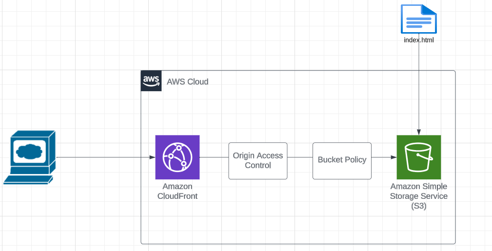

## Comprehending DevRel

Developer Relations, or DevRel for short, is a critical position that has emerged in the rapidly changing technology landscape. Its purpose is to serve as a bridge between developers and the broader community. We will discuss the foundations of DevRel, its importance in the tech sector, and how it might be a fulfilling career path for people who are enthusiastic about technology and community involvement in this guide.
[Read More](./devrel.md)

## Creating a Static Website Host: Manual vs. Automated (using Terraform)

Knowing how to manually set up a static website host is a necessary prerequisite to automating the entire process, particularly if you're not familiar with cloud computing. You can better understand how everything is connected by getting hands-on experience by clicking through the cloud resources, much like you learn basic maths before using a calculator.
[Read More](./static-site-s3-cloudfront/static-website.md)

## Deploying a Node Express server on Amazon EC2 with Docker and GitHub Actions.

We will delve into the topics of automated deployment and containerisation in this guide. Using GitHub Actions, I will walk you through the process of dockerizing a basic node.js application and deploying it to an Amazon EC2 instance.
[Read More](./ec2-docker-git-actions/ectwo-docker-actions.md)

## Subdomain Creation and Elastic Beanstalk Integration
This tutorial guides you through the process of creating a subdomain using Amazon Route 53 and seamlessly integrating it with an Elastic Beanstalk environment. Learn how to establish a distinct subdomain, enabling you to organize and host various applications efficiently. 
[Read More](./subdomain-ssl-doc/subdomain.md)

## Pros and Cons of Using Terraform
In the realm of Infrastructure as Code (IaC), Terraform has risen to prominence as a powerful tool for provisioning, managing, and scaling cloud infrastructure. While Terraform offers numerous advantages, it's essential to understand when and when not to use it in your DevOps journey.
[Read More](reasons-to-use-terraform.md)

