# Create a Subdomain in Route53 and Attach it to Elastic Beanstalk Environment

This tutorial guides you through the process of creating a subdomain using Amazon Route 53 and seamlessly integrating it with an Elastic Beanstalk environment. Learn how to establish a distinct subdomain, enabling you to organize and host various applications efficiently. 

## Step One: Create hosted zone for subdomain
 1. Log in to AWS Console
 2. Search for Route53 on AWS Services
 3. Click on `Hosted zones` on the route53 dashboard 
    
 4. Click on `Create hosted zone` button
    

 5. Fill the form
 - On `Domain name` field enter the full url to your subdomain
 - On `Description` field Write a description of your choice
 - On `Type` select **Public hosted zone**
 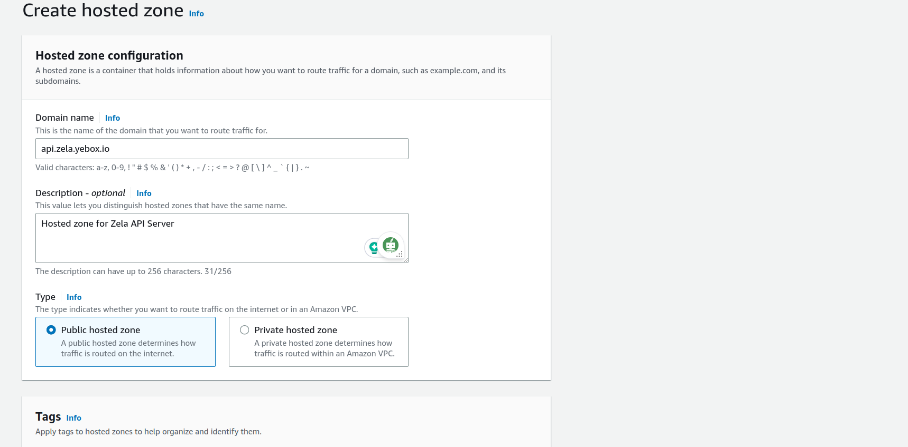
 - Add tag if you want to 
 Then click on `Create hosted zone` orange button
 
 
  Should see a page like this if successful
  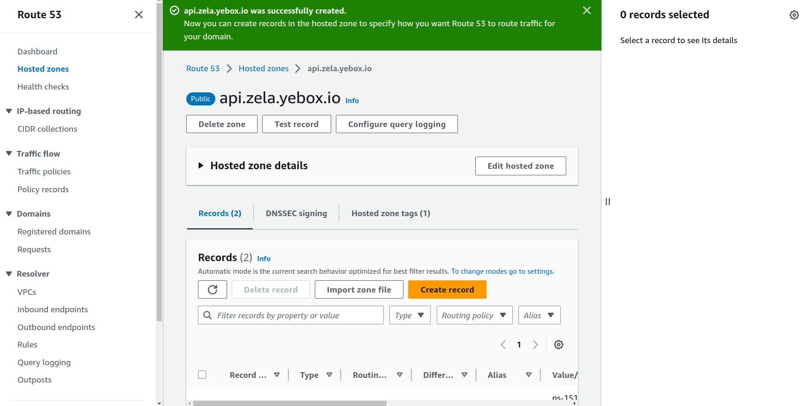

## Step Two: Add subdomain NS Values as record on Primary Domain
1. Scroll down a bit on your newly created subdomain and copy the `NS` values, all four of them

2. Click on `Hosted zone` from the left navigation pane 
3. Look for your primary domain(If you have many domains on the list) and click on it
4. In the primary domain page click on `Create record`

5. Fill the form
- On `Record name` type your subdomain name **Don't include the primary domain name, it will be added by default**
- On `Record type` Select `NS` from the list
- On `Value` Paste the NS Values you copied from the subdomain
- On `Routing policy` Select **Simple routing**
- Leave TTL as `Default`

Then Click on `Create records` button
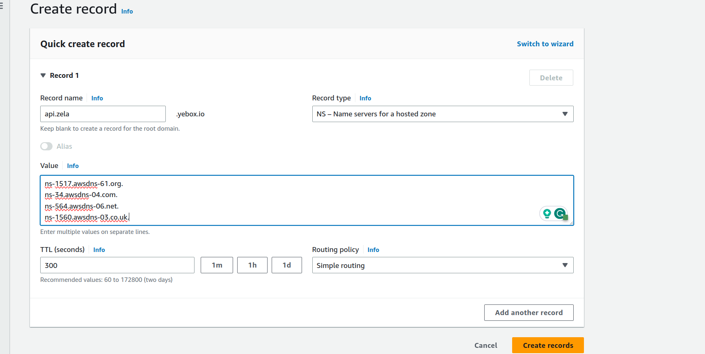

Successful message should appear if it went well

## Step Three: Create Certificate
1. Type `Certificate manager` on the search box and click on the search result

2. Click on the orange color `Request a certificate` button

3. Select `Request a public certificate` Then click **Next**

4. Fill the form
- On `Fully qualified domain name` Enter your subdomain name including the primary domain name
- On `Validation method` Select **DNS validation - recommended**
- On `Key algorithm` Select **RSA 2048**
- You can add tag if you want.
- Then scroll down and Click on the **Request** button
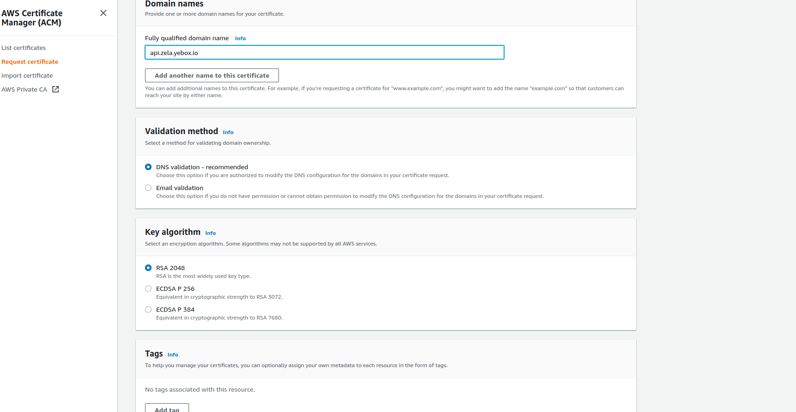

5. If successful, `Status` should display **Pending validation** 
Click on the `Certificate ID or Name`

6. Click on `Create records in Route 53` button

7. Click on the `Create records` button

8. If DNS record creation successful

9. Wait for one to five minutes and refresh your page, the validation status should change from **`Pending validation`** to **`Issued`**
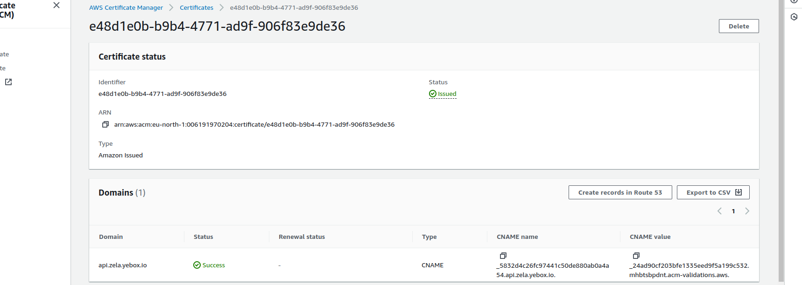

## Step Four: Add Listener on Elastic Loadbalancer

1. Search for `elastic beanstalk` and click on it
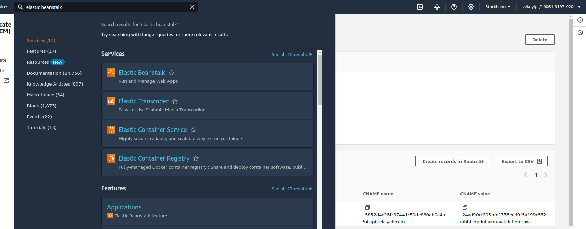

2. Click on the name of your elastic beanstalk `Environment name`

3. Click on `Configuration` from the left pane and scroll down

4. If your `Load balancer` under **Instance traffic and scaling** category, under `Capacity` is not editable. Click `edit` on the **Instance traffic and scaling** category. 
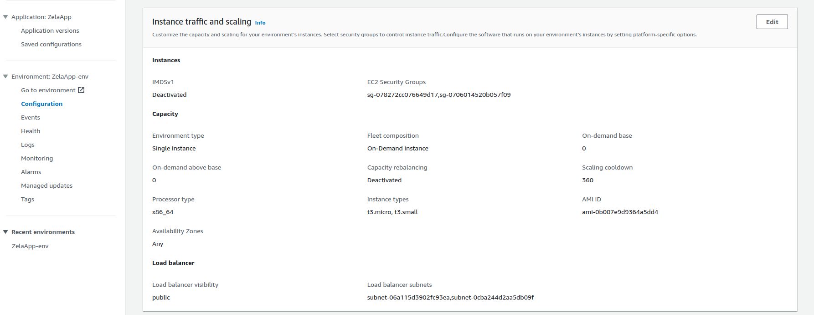

**Note: You selected `Single instance` rather than `Load balanced` when creating your elastic beanstalk, which is why your load balancer details are not displayed.**

5. Still under **Instance traffic and scaling** under `Capacity` then `Auto scaling group` then **Environment type** Select **Load balanced** then scroll down 

6. On `Listeners` Click **Add listener** button 

7. Fill the `Add listener` form
- On `Listener port` select **443**
- On `Listener protocol` select **HTTPS**
- On `SSL certificate` choose the certificate you created
- On `SSL policy` Choose any on **2023**
- On `Default process` leave it on **default**
- Then click **save**
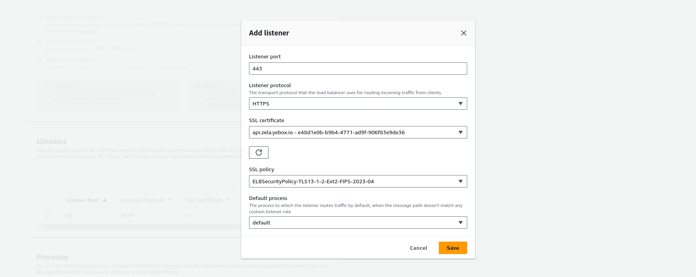

8. Scroll down to the bottom and click the **Apply** button

## Step 5: Create Alias for subdomain to use Elastic beanstalk
1. Search for Route53 on AWS Services
2. Click on `Hosted zones` on the route53 dashboard 
    
3. Click on your subdomain name, then click on the `Create record` button
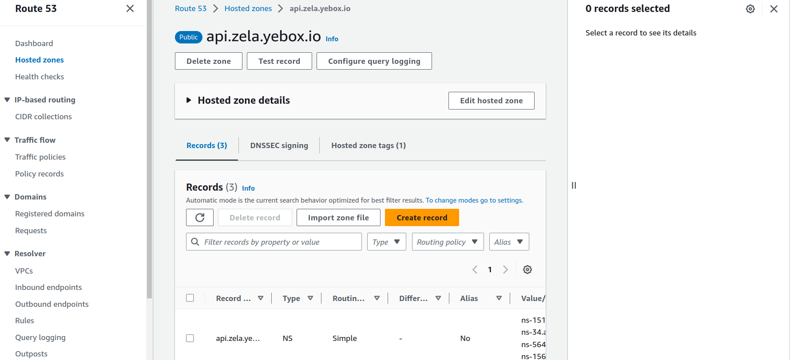

4. The initial create record should look like this
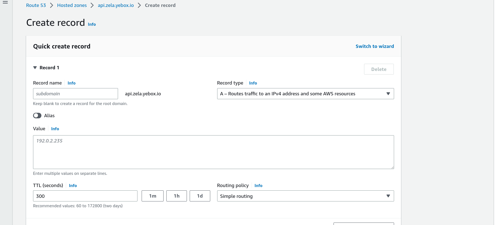

5. Fill the form
- On `Record name` **Leave it as is**
- On `Record type` select **A - Routes traffic to an IPv4 address and some AWS resources**
- Check or Click on the `Alias` button
- On the `Route traffic to` fields
  - On `Choose endpoint` select **Alias to Elastic Beanstalk environment** 
  - On `Choose region` select your region
  - On `Choose environment` select your elastic beanstalk environment
- On `Routing policy` select **Simple routing**
- `Evaluate target health` can be **Yes**
- Then click on **Create records** button

6. If everything was done correctly, a success message will appear.

## Step 6: Redirect HTTP to HTTPS
1. Search for EC2 and click on the search result
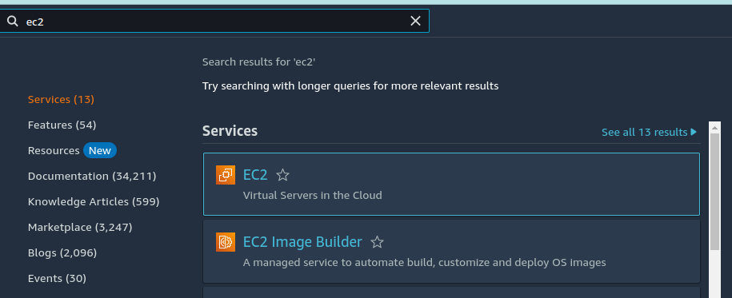
2. Click on `Load Balancers` on the side menu

3. Click on the name of your load balancer 
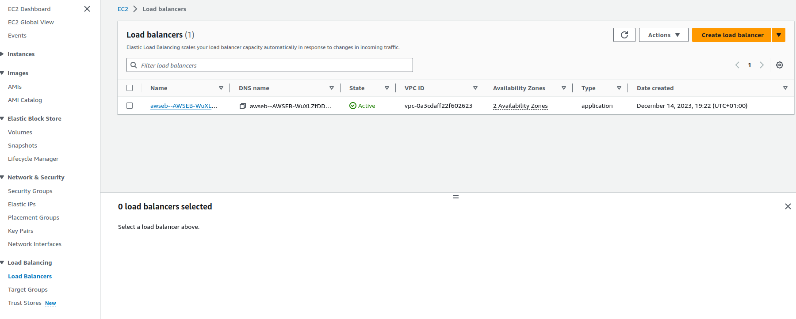
4. Then click on `HTTP:80` at the bottom
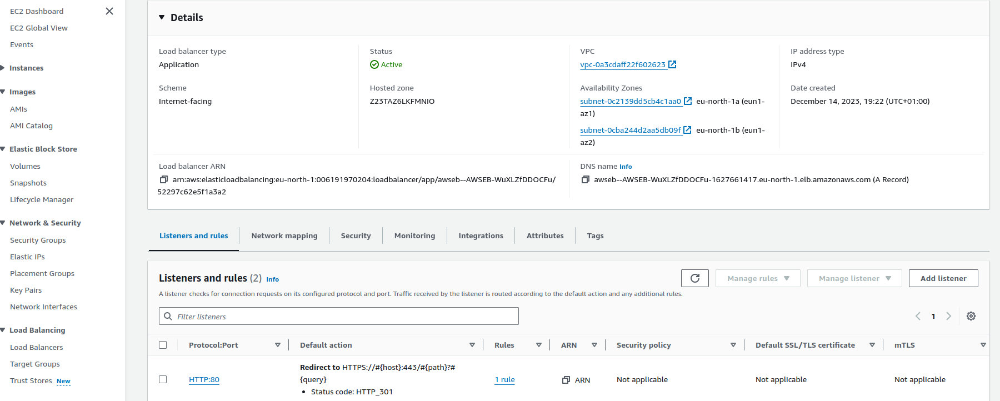
5. Click on `default`

6. Click on `Actions` then click on `Edit rule`

7. Leave `Listener details` and `Listener configuration` as it is. Then fill out the  `Default actions` category
   - On `Routing actions` tick **Redirect to URL**
   - On `Redirect to URL` select **URI parts**
   - On `Protocol` select **HTTPS**
   - On `Port` type **443**
   - On `Status code` select **301 - Permanently moved**
8. Click **save changes**

**Successfully modified listener message should display if successful**

9. Enter your newly created subdomain in a browser, it should have https.