## To Access the AWS console

1. Click this link [aws-console](https://006191970204.signin.aws.amazon.com/console)

Enter username and password, then click sign in

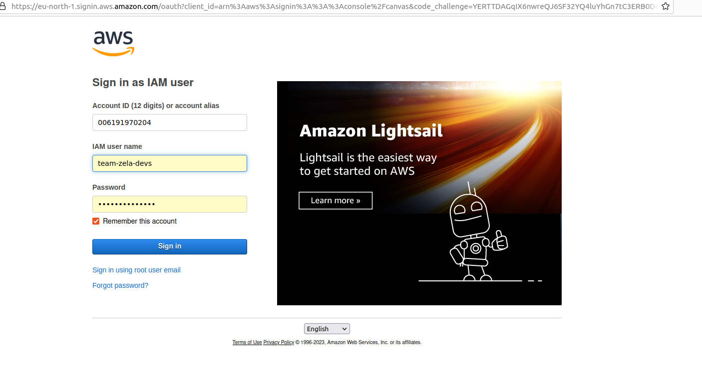

If sign in is successful, you should see this page

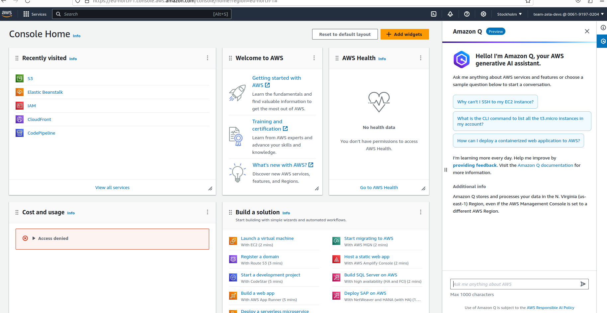

On the search field, type `S3` and click on the `S3` search result

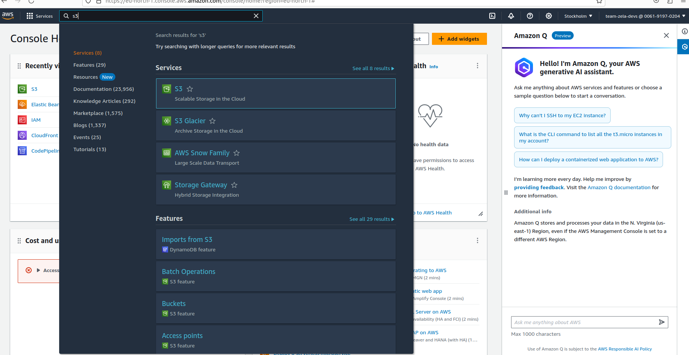

The s3 buckets listed page after clicking on s3

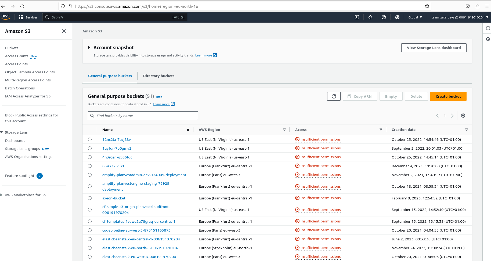

Scroll to the bottom of the page and click on the last bucket named
 `zela-team-public-bucket`

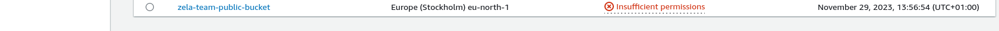

The page after clicking on the bucket name
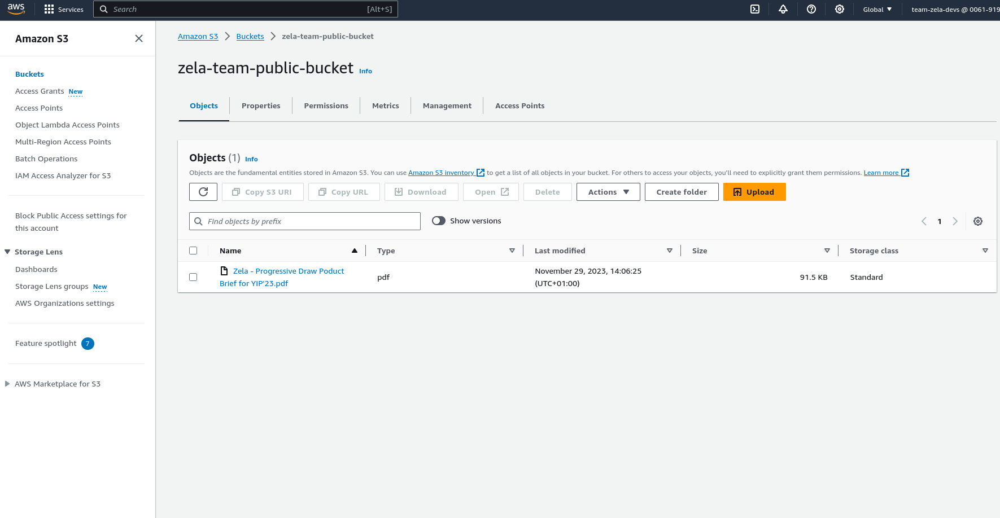

To upload file click on the orange upload button

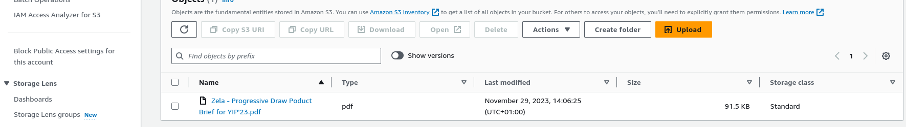

Clicking on the upload button should give this page

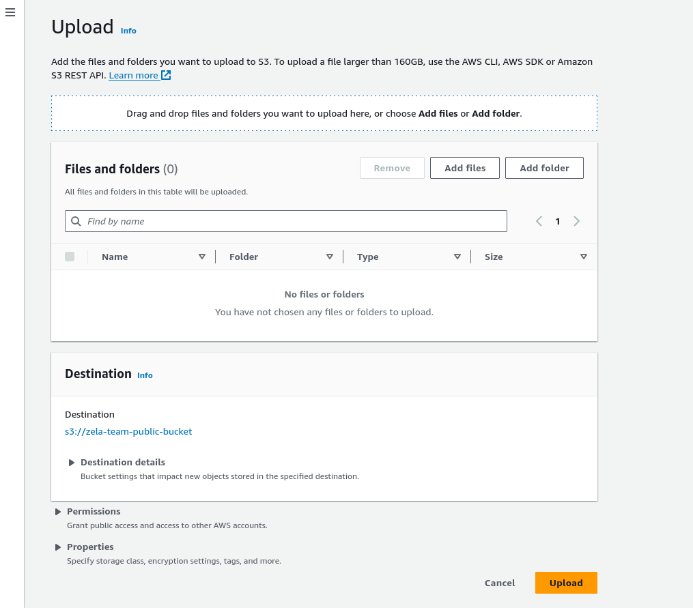

To upload a file click the `Add files` button.

To upload folder click on the `Add folder` button

After clicking on `Add file` and choosing your file to upload, your chosen file should appear here

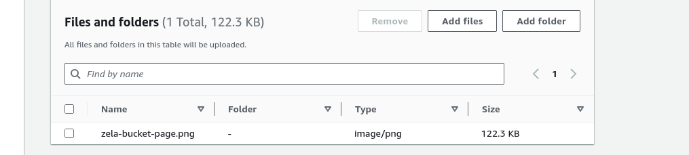

Click on the `upload file` file

Wait for the progress bar to complete and show successful

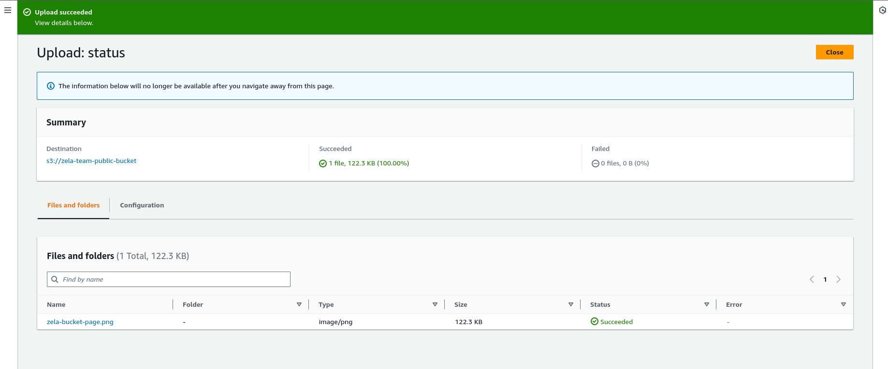

Then click on the `close` button

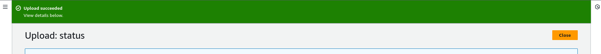

You should see your uploaded file in the list of other files

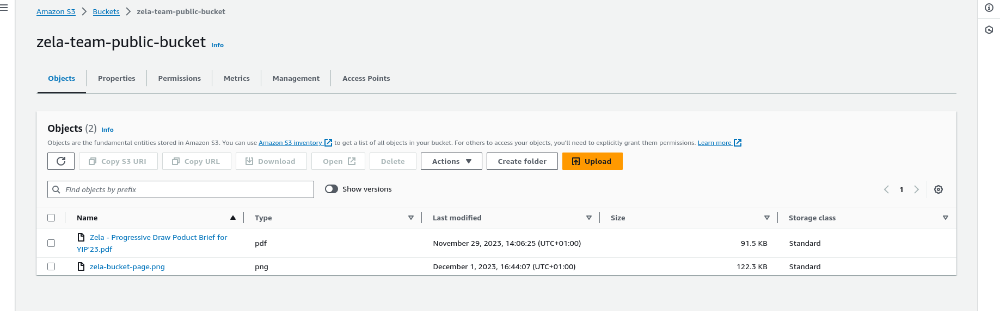

Click on your file name, it should open a page like this

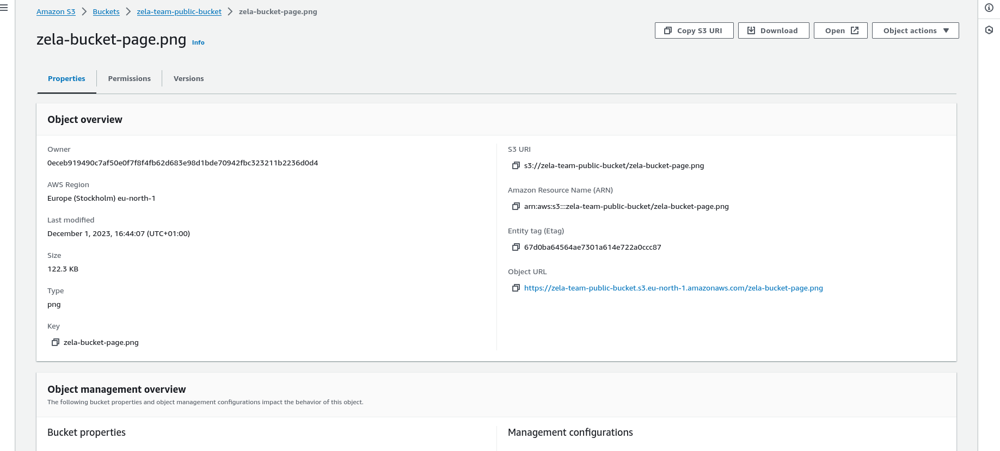

The file url is listed here

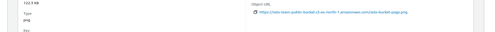

